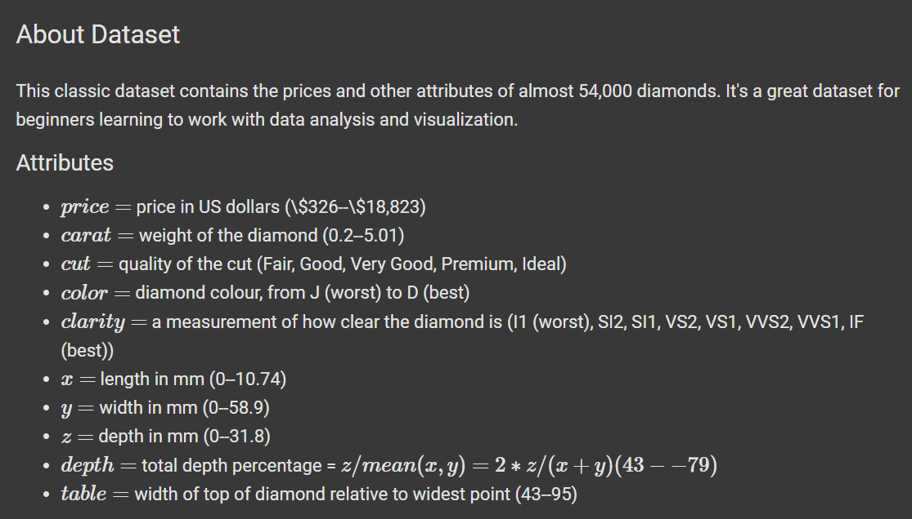

# Diamonds Dataset Exploratory Data Analysis (EDA)
It's my first EDA Task from Session 9 of 

## Introduction

 <!-- Replace pic1.png with the actual image file name -->

**Statement of Purpose:**

This project aims to perform an exploratory data analysis on the Diamonds dataset to gain insights into the characteristics of diamonds, their relationships with each other, and the factors that influence their prices. The analysis will involve visualizing distributions, exploring correlations, and identifying potential patterns within the data.

## Visualizations

 <!-- Replace pic2.png with the actual image file name -->
 <!-- Replace pic3.png with the actual image file name -->

## Analysis Headlines

Here's a summary of the analysis performed in this project:

1. **Variable Identification:**
    - Identifying the types of variables (numerical and categorical) present in the dataset.
    - Understanding the basic properties of each variable.

2. **Univariate Analysis:**
    - Exploring individual variables to understand their distributions, central tendencies, and potential outliers.
    - Analyzing continuous variables using histograms, box plots, and descriptive statistics.
    - Analyzing categorical variables using frequency tables and count plots.

3. **Bi-variate Analysis:**
    - Investigating relationships between pairs of variables.
    - Using scatter plots for continuous-continuous variable relationships.
    - Using stacked column charts for categorical-categorical variable relationships.
    - Using box plots for categorical-continuous variable relationships.
    - Performing correlation analysis using a correlation matrix.

4. **Missing Value Analysis:**
    - Checking for missing values in the dataset and understanding their impact on the analysis.

5. **Outlier Analysis:**
    - Identifying potential outliers in the data and exploring their potential causes.

## Conclusion

This exploratory data analysis provides valuable insights into the Diamonds dataset, highlighting key relationships between diamond characteristics and price. The findings can be used to inform further analysis, modeling, and decision-making related to diamond pricing and evaluation.

## Contributing

Contributions and suggestions are welcome! If you find any issues or have ideas for improvements, please feel free to create a pull request or open an issue.
